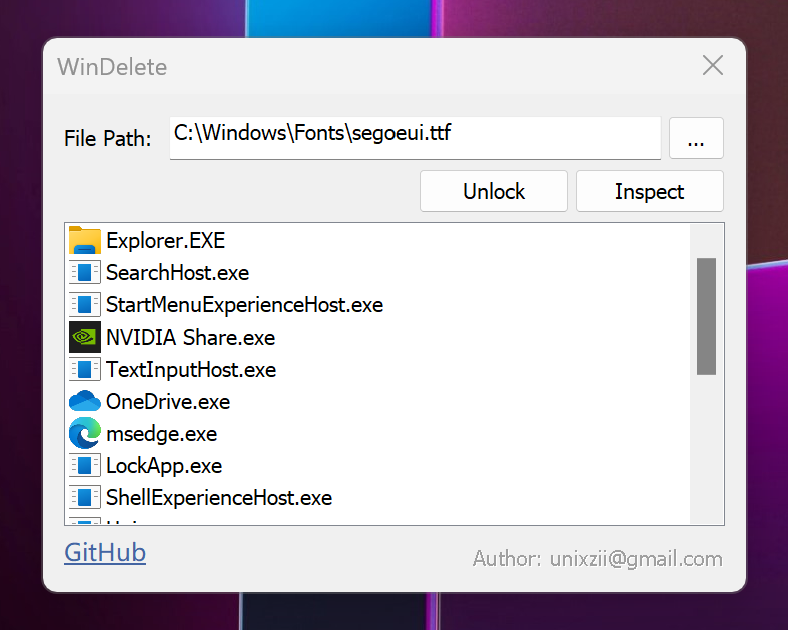

# WinDelete

## About

WinDelete is a simple program to help you unlock the file that may be used by some running applications. It won't delete the file directly, instead, it closes any handle of the file which prevent you from deleting the file.

## Installing

### Via GitHub Releases

Go to [releases page](https://github.com/unixzii/WinDelete/releases), click on `Assets` at the bottom to show the files available in the release.

### Build Locally
Requirements:
* Windows 10 (20H1) or newer.
* Visual Studio 2022

Clone this repository and open `WinDelete.sln` to build the executable. 

## Usage

Select the file (or input the path manually) first, then you can click "Inspect" to see which processes are currently using the file, and click "Unlock" to close the opened handles to the file.

## License

MIT